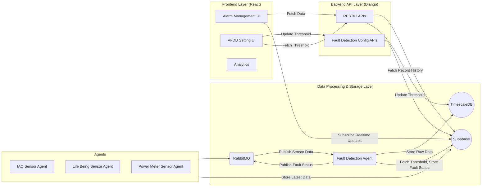

# Hotel IoT  Automatic Fault Detection and Diagnostic (AFDD)


This full-fledged system features the following:
- IoT sensor data simulation agent
- IoT sensor fault detection agent
- Data Management with RabbitMQ, TimescaleDB and Supabase
- Backend with Django + Rest API
- Frontend with React + Vite + Tailwind
- Data Analytics (not implemented yet)

## IoT Sensor Data Simulation And Fault Detection Agent
Sensor data simulation agent is for Indoor Air Quality (IAQ) sensors that generates and publishes simulated sensor data to RabbitMQ and Supabase. This agent supports advanced data generation for temperature, humidity, CO2 levels, occupancy, and power consumption, and provides methods for publishing data to RabbitMQ and Supabase.<br>

Fault detection agent is designed to facilitate fault detection in IoT-based hotel systems. It integrates with various services such as RabbitMQ, Supabase, and TimescaleDB to process sensor data, detect anomalies, and publish alerts. The class provides methods for initializing database connections, managing RabbitMQ exchanges and queues, subscribing to real-time updates, and detecting faults based on predefined or dynamically updated thresholds. <br>

Both of these agents are available as python modules. Their API reference can be found [here](https://kaunghtetsan275.github.io/hotel_iot_afdd_data_simulation)

## Spicy Diagrams

<p style="text-align:center;">System Architecture Diagram of Hotel IoT AFDD</p>
<p style="text-align:justify;">
This system architecture consists of four layers: simulated sensor agents (IAQ, Life Being, Power Meter) publish data to RabbitMQ and Supabase in the Agent Layer. In the Data Processing & Storage Layer, RabbitMQ routes data to a Fault Detection Agent for fault detection and receives fault status in return. The agent also stores raw data in TimescaleDB for historical data analysis, fetches threshold from and publishes fault status to Supabase. The Backend API Layer (Django) acts as an API gateway to expose RESTful APIs for fetching data and updating fault detection thresholds between Frontend Layer and Database Storage Layer. The Frontend Layer (React) includes an Dashboard UI for monitoring and an Configuration UI for configuring thresholds, both interacting with Supabase and backend APIs, with real-time updates handled via Supabase subscriptions.
</p>

## Installation And Usage

This project uses **docker-compose** to manage and run multiple services. Configuration values are stored in a `.env` file for easy setup and portability. You can also run each service separately in [django backend](https://github.com/kaunghtetsan275/hotel_iot_afdd_backend) repo and [simulation agent](https://github.com/kaunghtetsan275/hotel_iot_afdd_data_simulation) repo.
## 📦 Prerequisites
---
- [Docker](https://www.docker.com/products/docker-desktop) installed
- [Docker Compose](https://docs.docker.com/compose/install/) installed
- Git installed
- .env file
---
## 📁 Clone the Repository
```bash
git clone https://github.com/kaunghtetsan275/hotel_iot_afdd_frontend.git
cd hotel_iot_afdd_frontend
```
## ⚙️ Environment Configuration
Create a .env file in the root directory with the necessary environment variables.

💡 Customize the values based on your environment.
Go to the cloned repository and start using docker-compose.
🚀 Usage
🛠 Build and Start the Services
```bash
docker-compose build
docker-compose up -d
```
🛑 Stop the Services
```bash
docker-compose down
```
📂 Project Structure
```bash
.
├── docker-compose.yaml
├── .env
├── public
├── src
├── docs
│   └── ...
└── README.md
```

📞 Contact
For further information, reach out to kevin@cattt.space
